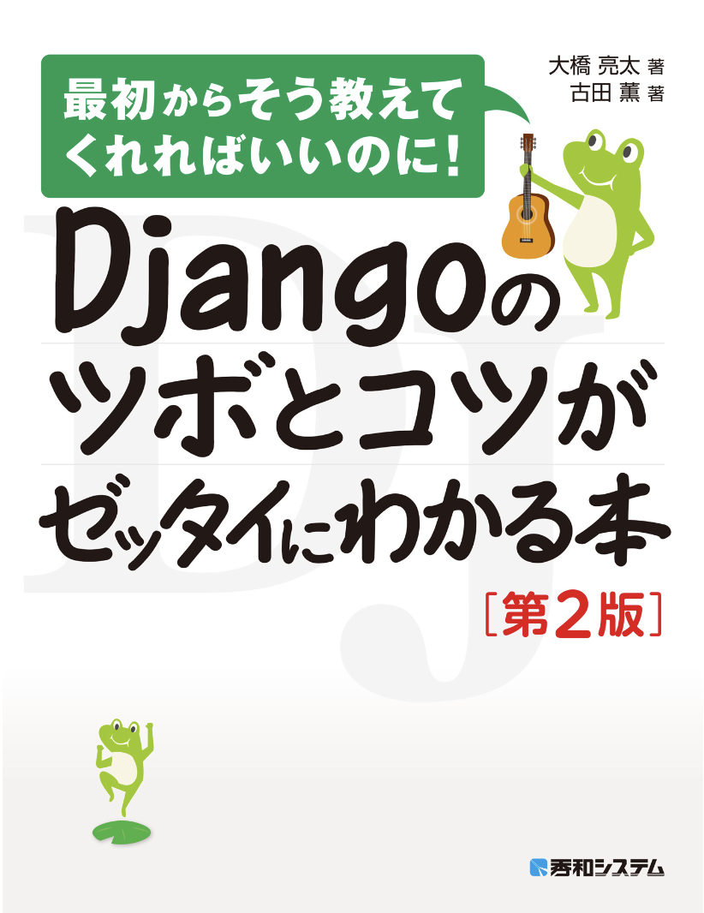

# 本レビュー
## タイトル Djangoのツボとコツがゼッタイにわかる本
###  この本を買った理由
#### この本を買った理由はDjangoのフレームワークで課題を進めていたためちょうど良いと思い買いました。
#### Djangoに関する本は色々あるのですがこの本が人気が高くて評価もそこそこ良かったのでこれに決めました。

###  良いところ
* 環境構築の説明
*　重要度の説明
* アプリ作成を通して学べる

#### フレームワークの概念から環境構築の説明まで丁寧に書いているところです。画像がついていてわかりやすいです。
#### Djangoには用途にあったファイルがあるのですがそのファイルの重要度を低、中、高で説明しています。
#### この本では本棚アプリケーションを作成しながら学んでいくわけですが、会員登録機能などの説明がされていて、
#### 本棚アプリを全て作り上げなくても一部の機能だけを切り取って学ぶこともできます。

